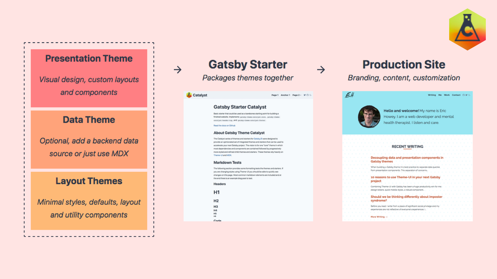
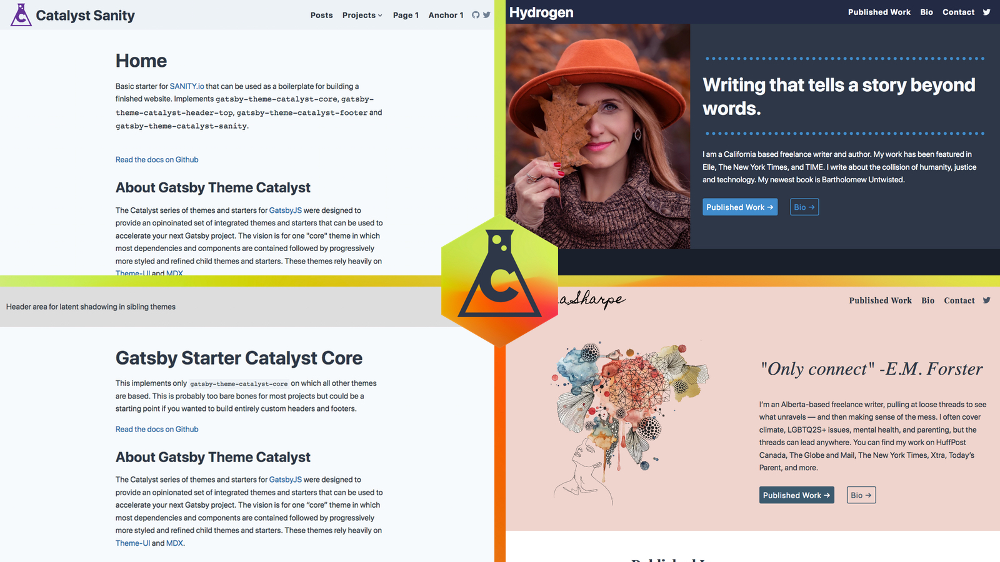

Some quick background on how [Gatsby Theme Catalyst](https://www.gatsbycatalyst.com/) came to be. I am a casual freelance web developer; my time is limited and so maintainability and reusability are crucial for me. Like many freelancers I was often working with Wordpress. One of the perennial challenges with Wordpress is security. Looking to address this challenge led me to the JAMStack - and ultimately to Gatsby. When I read about the experimental release of Gatsby themes I was sold. I started working on early versions of Gatsby Theme Catalyst shortly thereafter and submitted a work in progress for the theme jam last year.

Gatsby Theme Catalyst is an opinionated set of integrated themes and starters to accelerate your next Gatsby project. Build faster.

The themes are designed to be maintained via npm package updates, reusable across different contexts, and extendable through component shadowing. Styling is handled via Theme-UI and a centralized theme file which controls values like color, logo size, spacing, fonts, etc. This level of integration between themes allows you to quickly launch a working prototype and focus energy on custom portions of a website design.

## What makes Gatsby themes special

Traditional site templates are built as a singular monolithic theme, and there is nothing inherently wrong with this approach. But what makes [Gatsby themes](/docs/themes/) special, in my view, is that your final site can stitch multiple themes together, each theme playing a distinct role in the finished site. [Component shadowing](/docs/themes/shadowing/) provides granular control over how the themes are merged and allows you to customize the final result. Themes are then published as an npm package and updated like any other dependency.

This pattern of composing your final site from smaller discrete blocks unlocks enormous development and design opportunities. Last week I added canonical link generation to my SEO component. Every site using Gatsby Theme Catalyst got this improvement automatically when they updated their package versions! No more digging through code on 10 different projects.

## Different types of themes

Working extensively with Gatsby themes for the last year has led me to believe themes can be separated into different categories based on their purpose; core themes, layout themes, data themes, functional themes, and presentation themes. This is the pattern that has emerged as I built Gatsby Theme Catalyst.



### Core themes

The core theme acts as your imaginary home foundation - it is where most dependencies are maintained, utility components are exported, and some basic layout components are provided. The layout components focus on a minimal site architecture and are intended to be modified using component shadowing.

The main win of this approach is that you centralize managing and updating dependencies all in one place without having them distributed across multiple themes.

### Layout themes

Layout themes act as the framing of your home - they focus on structure and function on top of a foundation. No paint on these walls. To date I have focused on the header and footer areas of a site. Changing headers becomes as simple as adding a package and swapping out a line in `gatsby-config.js`.

The big win here is reusability. Build a few really solid headers and then reuse them on different websites. Bug fix once and the update is instantly available to all of your sites via npm!

### Functional themes

Functional themes are like a major appliance in your home - you add them in or take them out without affecting the site as a whole. A good example of this is [gatsby-mdx-embed](https://www.gatsbyjs.org/packages/@pauliescanlon/gatsby-mdx-embed/) which allows you to embed social media content directly in your MDX content.

The major win here is ease of use, you can add these themes as needed. Plug and play feature enhancement.

### Data themes

Data themes act as the wiring or plumbing in your home - where is the data coming from and where is it going? I made an opinionated decision in Gatsby Theme Catalyst that at the very least you should be using MDX and Git for this. However, I have also created a data theme for [SANITY.io](https://www.sanity.io/) using this approach.

The win this provides is enabling flexibility in the data source. Admittedly this is an area that is more complicated however early patterns are emerging - the key is to make sure you [seperate your data queries and presentation components](https://www.erichowey.dev/writing/decoupling-data-and-presentation-components-in-gatsby-themes/). Changing the plumbing in your home isn’t easy.

### Presentation themes

Presentation themes are the paint, trim, cupboards, furniture, etc in your home - the unique visual design elements of your site. At this point themes get more specialized and focus on the components unique to a particular kind of site. For example I made a theme focused on freelance writers that has a specific page component for listing their published work. Typically these themes provide some basic color choices but allow the final colors to be set via Theme-UI in the production site.

## Theme-UI

[Theme-UI](https://theme-ui.com/) provides a CSS-in-JS framework (based on [Emotion](https://emotion.sh/docs/introduction)) with a constraint-based design system defined in a theme specification file. Theme-UI is like hiring an interior designer for your home: it visually unifies themes together, while allowing the themes themselves to remain unopinionated about design choices like color.

Theme-UI is used throughout Gatsby Theme Catalyst. Want to change your primary color or fonts? Just tweak some values in your theme file and off you go!

## Getting started with Gatsby Theme Catalyst

[Read the getting started guide](https://www.gatsbycatalyst.com/docs/getting-started)

```shell
gatsby new catalyst https://github.com/ehowey/gatsby-starter-catalyst
```

This gives you a basic installation of Gatsby Theme Catalyst including the core theme, a header theme, and a footer theme. By default content is authored in MDX. The intention is that this is a jumping off point for a custom site, check out the [source code](https://github.com/ehowey/erichoweydev) for my personal site to see a custom example in action.

For an example of a production ready starter with content sourced from SANITY.io, a presentation theme, and more complex component shadowing take a look at [gatsby-theme-catalyst-hydrogen](https://www.gatsbycatalyst.com/docs/tutorials/building-a-website-for-a-freelance-writer-using-gatsby-theme-catalyst-hydrogen) which is a theme designed for freelance writers. This theme layers together 5 different sub themes in the finished site!



Gatsby Theme Catalyst is an open source project. Ideas, suggestions and issues are always welcome. I would also love to hear about any projects you create with it!

Happy coding!
